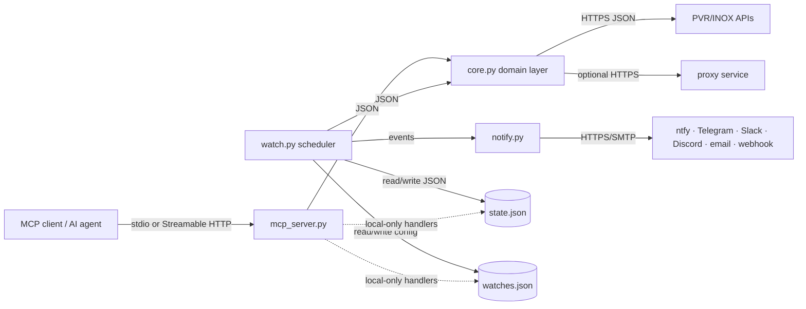
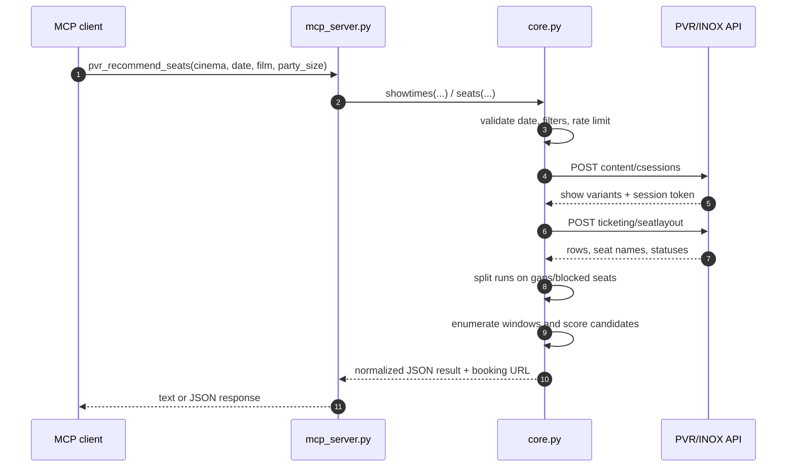
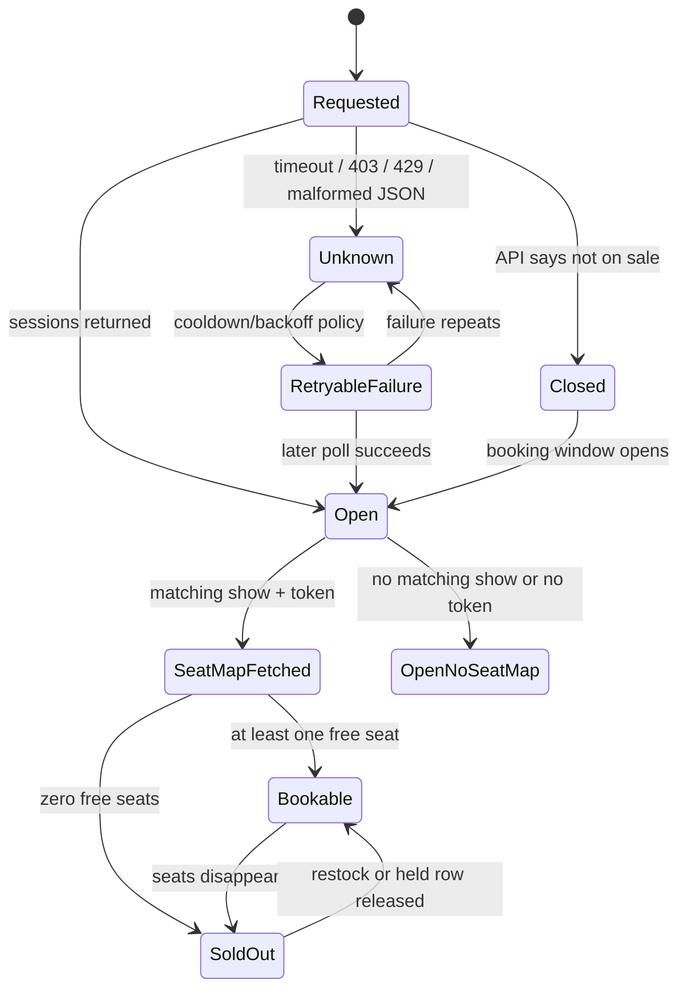
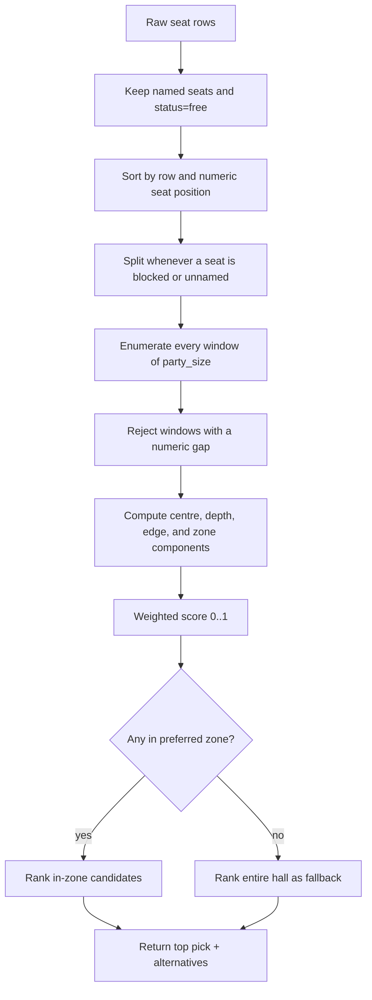
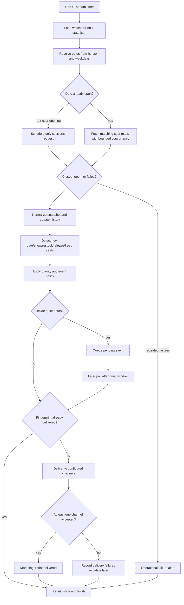
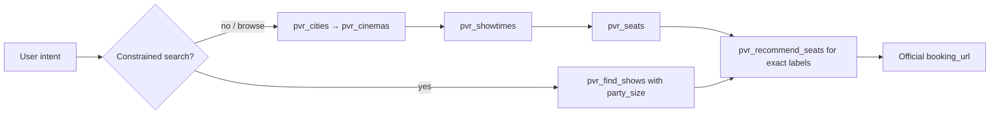
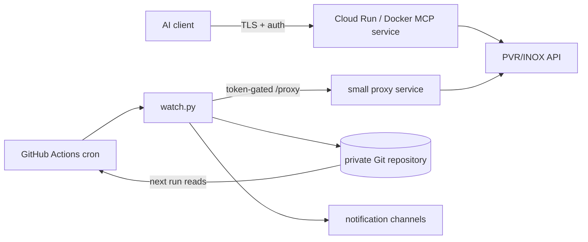
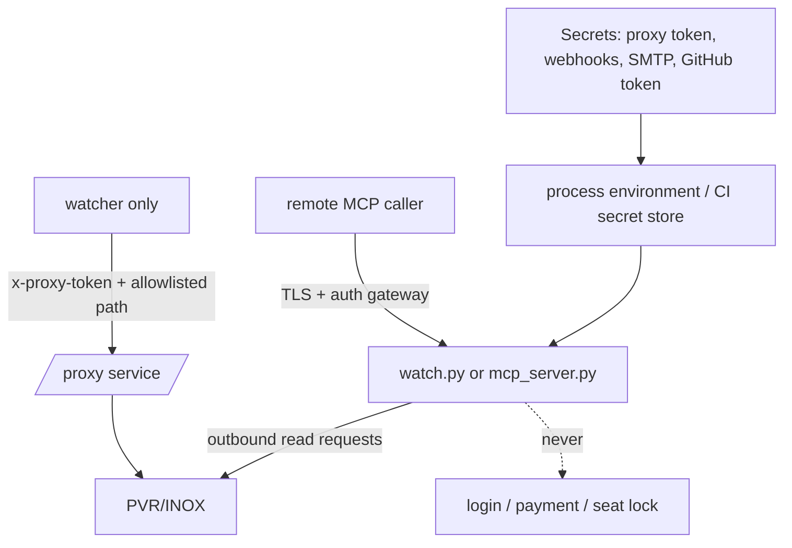

# SeatSignal — Complete Project Guide

This document explains the project from the outside in: what problem it solves,
how data moves through it, what each process does, how seat recommendations are
calculated, how the watcher avoids false alerts, how to run it, and where its
boundaries are.

## 1. The project in one sentence

SeatSignal is a read-only cinema intelligence service for India that turns
PVR/INOX's web booking data into AI-callable tools, aisle-aware exact seat
recommendations, and durable notifications when a desired booking opportunity
appears.

It is not a ticket-buying bot. It stops at discovery, analysis, notification,
and an official booking link.

## 2. The problem it solves

A cinema listing saying `Available` does not answer the question a person
actually cares about. A hall can have hundreds of free seats while every
back-centre pair is gone. Advance booking can open on an unpredictable rolling
window. PVR can also hold rows back and release them later without changing the
high-level show status.

The project solves four separate problems:

1. Discovery — find a city, cinema, film, format, language, and date.
2. Verification — distinguish not-yet-on-sale, bookable, sold-out, completed,
   and failed-to-fetch states.
3. Seat intelligence — understand rows, aisles, seat status, preferred viewing
   zones, and exact adjacent groups.
4. Durable monitoring — remember the previous observation and notify only when
   a meaningful transition occurs.

## 3. What it does not do

The project intentionally does not:

- log into a personal account;
- solve CAPTCHA or bot challenges;
- lock seats;
- submit a booking;
- handle payment, OTP, or checkout;
- scrape rendered browser pages;
- automate BookMyShow or bypass its access controls;
- claim to be an official PVR/INOX integration.

Those boundaries keep the system read-only, easier to operate, and safer to
deploy.

## 4. System architecture

There are two user-facing modes and one shared domain layer:

```text
                         ┌──────────────────────┐
                         │  MCP client / agent  │
                         │  natural language    │
                         └──────────┬───────────┘
                                    │ stdio or Streamable HTTP
                         ┌──────────▼───────────┐
                         │    mcp_server.py     │
                         │ typed read-only tools│
                         └──────────┬───────────┘
                                    │
              ┌─────────────────────▼─────────────────────┐
              │                  core.py                  │
              │ API client · title parsing · seat logic   │
              │ rate limit · retries/cooldown · geometry  │
              └─────────────────────┬─────────────────────┘
                                    │ HTTPS JSON
                         ┌──────────▼───────────┐
                         │ PVR/INOX web services │
                         │ sessions / seat map  │
                         └──────────────────────┘

              ┌─────────────────────┐
              │      watch.py       │
              │ poll → diff → state │
              └──────────┬──────────┘
                         │ alerts
              ┌──────────▼──────────┐
              │     notify.py       │
              │ ntfy/Telegram/etc.  │
              └─────────────────────┘
```

`core.py` is deliberately shared. The MCP server and watcher must agree on
what a show, a free seat, a preferred zone, and a booking state mean.

### 4.1 Component flow

The following diagram shows the runtime boundaries. Arrows labelled `HTTPS`
are outbound network calls; arrows labelled `JSON` are in-process data passed
between Python modules.



### 4.2 One lookup from request to response

This is the normal `pvr_recommend_seats` path. A recommendation request first
resolves the show, then fetches its layout, and finally ranks exact adjacent
groups. There is no booking or seat lock at the end of the sequence.



## 5. Repository map

### `core.py`

This is the domain and integration layer. It contains city and cinema discovery,
API request headers and payloads, request pacing and upstream-block cooldown,
optional proxy routing, distance calculations, film/language/format parsing,
showtime normalization, booking-window detection, seat-map parsing,
preferred-zone derivation, contiguous-run detection, exact recommendations,
show-state classification, and learned screen geometry.

The watcher and MCP server should not independently reimplement these rules.

### `mcp_server.py`

This is an adapter around `core.py`. It defines MCP tools, validates inputs,
formats text/JSON responses, marks tools as read-only, and restricts filesystem
and Git-writing tools to local stdio mode.

Remote mode intentionally does not register watch-management tools because
`pvr_publish_watches` can commit and push to Git. Removing those handlers from
the remote tool registry is safer than relying on a runtime guard.

### `watch.py`

This is a stateful polling process. It loads watch definitions, calculates dates
worth checking, fetches showtimes, optionally fetches matching seat maps
concurrently, carries forward seat history, compares snapshots, applies quiet
hours and duplicate suppression, delivers alerts, records failures, and chooses
a future polling cadence.

### `notify.py`

This is a channel adapter. It discovers configured channels from environment
variables and sends the same logical alert to every configured destination:
Slack, Discord, Telegram, ntfy, Pushover, SMTP email, generic webhooks, and
GitHub Issues.

### `watches.json`

This is the operator's desired monitoring configuration. It is not a database;
it is a small declarative file that can be versioned with the watcher.

### `state.json`

This is generated runtime state. It contains prior show snapshots, accumulated
seat history, booking-window timestamps, heartbeat state, pending quiet-hour
events, duplicate-suppression timestamps, and repeated-failure records.

### `.github/workflows/watch.yml`

This runs the watcher on a schedule, supplies secrets, and commits updated
`state.json` so the next scheduled run can calculate a diff.

### `Dockerfile`

This builds the remote MCP service. It intentionally contains only the server
files; the watcher is a separate operational process.

### `tests/`

The focused unit tests cover exact seat recommendation, aisle boundaries,
quiet-hour deferral, notification deduplication, priority caps, and repeated
failure escalation.

## 6. The upstream data flow

### 6.1 Cinema discovery

The cinema endpoint is queried with a city and coordinates. Coordinates matter
because the upstream service applies a distance filter. Each result is
normalized into a cinema ID, name, latitude, longitude, show count, and
distance where available.

Every later lookup depends on the cinema ID.

### 6.2 Showtimes

The sessions endpoint is called with a cinema ID and date. A future date that is
not yet on sale is represented differently from a network error:

- closed response → the booking window has not opened;
- successful response with sessions → date is open;
- timeout, 403, 429, or malformed response → unknown, not closed.

The parser resolves the individual show variant because one parent movie block
can contain multiple language and format prints. Language is therefore a
per-show property, not something inferred solely from a film's release list.

### 6.3 Seat maps

Each show contains an opaque/encrypted session value. The project passes that
value to the seat-layout endpoint; it does not need to decrypt it.

In the observed payload, status `1` means free, status `2` means taken, other
statuses are treated conservatively as held/withheld, and an entry without a
seat name is an aisle or grid gap.

The missing-name rule prevents a false claim that the last seat in one block
and the first seat in another are adjacent.

### 6.1 Request contract and normalization boundary

`core.py` sends the same small set of headers on each request. The exact
values are kept in one place so a PVR change is not scattered through the
watcher and MCP adapter:

| Concern | Current behavior |
|---|---|
| Base URL | `PVR_BASE_URL` or the default PVR/INOX web API origin |
| Authorization | A blank bearer header by default; override with `PVR_AUTH_TOKEN` if a deployment has one |
| Client identity | `chain`, `country`, `appVersion`, `platform`, and `flow` headers |
| City context | `city` header and city/latitude/longitude request fields |
| Main paths | `content/cinemas`, `content/csessions`, and `ticketing/seatlayout` |
| Response boundary | raw upstream JSON is converted into stable Python dictionaries before callers see it |

The normal form intentionally keeps both machine identifiers and display
labels. A session has a cinema ID, film ID, variant ID, language, experience,
screen, start/end time, opaque session token, and booking URL. This prevents a
human-readable title from being used as an unstable primary key.

### 6.2 Lookup state machine



`Unknown` is deliberately separate from `Closed`: a network failure must not
create a false “booking is not open” conclusion.

## 7. Preferred-zone calculation

If the operator specifies `zone_rows` and `zone_seats`, that configuration is an
instruction and is not widened by the watcher.

If no zone is specified, the project derives one from the auditorium:

- choose rows approximately 60–85% of the way back from the screen;
- find the aisle-delimited block containing the row midpoint;
- use that block as the horizontal preferred region.

This is geometry-based. Row letters are not portable between auditoriums.

When the derived zone cannot fit the party but a nearby row can, `seat_report`
may widen the zone and records `widened_to`. Explicitly configured zones do not
widen automatically because an operator who asks for a particular block may not
want an alert for a front-row compromise.

## 8. Exact seat recommendations

The original project reported the largest contiguous run. This version also
enumerates exact party-sized windows.

For a party of two and a free run `D11, D12, D13, D14`, the candidates are
`D11-D12`, `D12-D13`, and `D13-D14`. For a party of three, they are `D11-D13`
and `D12-D14`. No candidate crosses an aisle, sold seat, held seat, or missing
name gap.

Each candidate receives a deterministic, explainable score:

```text
score =
    0.45 × horizontal-centre score
  + 0.30 × viewing-depth score
  + 0.15 × edge-clearance score
  + 0.10 × preferred-zone score
```

The result includes exact labels, row and span, `in_zone`, a 0–1 score, each
component, human-readable reasons, and outside-zone alternatives. The score is
a recommendation, not a reservation; seats can change before checkout.

`pvr_recommend_seats` is the direct MCP interface. `pvr_seats` also embeds the
top recommendation in its structured result and plain-text summary.

### 8.1 Recommendation algorithm in detail



For one run of length `L` and party size `N`, the number of candidate windows
is `max(0, L - N + 1)`. Across `R` rows and `S` seats, the implementation is
linear in the input plus the number of candidates: approximately `O(R·S + C)`.
The exact labels are retained, so a consumer can display or deep-link to the
same seat names without reconstructing them from an index.

The horizontal-centre term is highest near the midpoint of the usable row;
viewing depth prefers the derived mid/back zone; edge clearance rewards space
on both sides of a group; and zone membership gives an explicit configured
zone a small deterministic bonus. The weighting is intentionally explainable
and can be changed without changing the API shape.

## 9. Show-state classification

The upstream's labels are not trusted as the complete truth. The project
combines time, token presence, and observed inventory:

- `ON_SALE` — future show with free seats;
- `LIMITED` — future show with less than 15% free;
- `SOLD_OUT` — no free seats observed;
- `NOT_ON_SALE` — scheduled but booking window not open;
- `CLOSED` — booking shut or screening already underway;
- `COMPLETED` — screening end time has passed.

Only `ON_SALE` and `LIMITED` are treated as bookable. Unknown is never silently
turned into a positive booking claim.

## 10. Watcher lifecycle

Each enabled watch has filters such as city, cinema, film substring, language,
experience, weekdays, party size, time window, and horizon.

The watcher uses three cadence modes:

- `cold` — one ordinary pass, then exit;
- `near_open` — schedule-only polling while a date is near its expected opening;
- `held` — seat-map polling when a date is open but the desired group is not yet
  available.

Schedule calls are cheaper than seat-map calls, and the upstream may block an IP
that is hammered. Seat maps are fetched concurrently for matching shows, but
started/lapsed shows are skipped. Sold-out shows are still fetched for restocks.

### 10.1 Poll and alert flow



## 11. Event detection

The watcher compares snapshots by date and stable show identity:

- `new_date` — a previously closed date now has sessions;
- `new_show` — a session appears on an already-open date;
- `back_in_stock` — a show transitions from unavailable to available;
- `released` — seats appear that had never previously been observed free;
- `seats_freed` — the best preferred-zone run crosses the configured threshold.

Seat history is tracked across the whole hall because withheld seats can be
outside the preferred zone. A seat never observed free is not necessarily sold;
it may never have been released for sale.

## 12. Notification controls

Each watch may include:

```json
{
  "priority": 5,
  "quiet_hours": ["23:00", "07:00"],
  "dedup_minutes": 30
}
```

Priority is clamped to 1–5. Quiet hours defer ordinary alerts and deliver them
after the window ends. Deduplication fingerprints the event kind, date, show,
and seat span; it records the fingerprint only after at least one channel
accepts the message. Failure alerts bypass quiet hours.

Use the test command to validate channel credentials without polling PVR:

```bash
python3 watch.py --test-notification
python3 watch.py --test-notification --watch "The Odyssey - IMAX - PVR Palazzo"
```

## 13. Failure detection

Heartbeat protection sends a “watch is blind” alert when the entire run has not
produced a successful upstream answer for the configured threshold.

Repeated poll failures, upstream blocks, and notification-channel failures are
also tracked in state. A failure must repeat before an operational alert is
sent. This avoids waking someone for one flaky request while exposing a stuck
proxy, blocked egress IP, bad webhook, or broken SMTP password.

Environment controls are:

```text
PVR_FAILURE_ALERT_AFTER=2
PVR_FAILURE_ALERT_REPEAT_HOURS=6
```

## 14. MCP tools

Read-only lookup tools:

- `pvr_cities` — supported city catalog;
- `pvr_cinemas` — cinema IDs and distances;
- `pvr_now_showing` — film catalog and formats;
- `pvr_showtimes` — showtimes for a cinema/date;
- `pvr_seats` — full seat availability and optional ASCII map;
- `pvr_recommend_seats` — exact ranked party-sized groups;
- `pvr_find_shows` — constrained multi-cinema search;
- `pvr_screens` — learned auditorium sizes;
- `pvr_is_open` — booking-window status.

Local-only watch tools:

- `pvr_list_watches`;
- `pvr_add_watch`;
- `pvr_remove_watch`;
- `pvr_publish_watches`.

### 14.1 Tool contract and recommended call order

| Tool | Required inputs | What it verifies | Cost/side effect |
|---|---|---|---|
| `pvr_cities` | none | supported city catalog and metro roll-ups | one discovery request |
| `pvr_cinemas` | `city` | cinema IDs, names, capabilities, distances | one city/cinema request |
| `pvr_now_showing` | `city` | films; with `language`, real scheduled language showtimes | schedule sweep; no seat maps |
| `pvr_showtimes` | `city`, `cinema_id`, ISO `date` | normalized show variants and derived state | one sessions request |
| `pvr_seats` | `city`, `cinema_id`, `date` | live inventory, zone counts, runs, optional map | up to 12 seat-map requests |
| `pvr_recommend_seats` | same as `pvr_seats` plus `party_size` | exact ranked labels and alternatives | reuses `pvr_seats`; no extra upstream request |
| `pvr_find_shows` | `city`, `party_size` | constrained multi-cinema bookable results | budgeted schedule + shortlist seat calls |
| `pvr_screens` | optional `cinema_id` | learned screen geometry | local read of `screens.json` |
| `pvr_is_open` | `city`, `cinema_id`, `date` | whether the rolling booking window is open | one sessions request (and horizon probe when closed) |

The reliable conversational sequence is:



Use `format="json"` when another tool or program needs to compute over the
result. Text is optimized for a human; JSON is the stable integration surface.
Errors begin with `ERROR <CODE>:` and are intentionally separate from positive
availability facts.

## 15. Running locally

The watcher is standard-library-only:

```bash
python3 watch.py --dry-run --show-all
python3 watch.py --once
python3 watch.py --stream --interval 60
```

The MCP server needs the pinned dependency in `requirements.txt`:

```bash
python3 -m venv .venv
source .venv/bin/activate
pip install -r requirements.txt
python3 mcp_server.py
```

Local MCP uses stdio by default. Remote HTTP mode is enabled with:

```bash
PVR_MCP_TRANSPORT=streamable-http \
PVR_MCP_HOST=0.0.0.0 \
PVR_MCP_PORT=8760 \
PVR_MCP_ALLOWED_HOSTS=example.com \
python3 mcp_server.py
```

Put TLS and authentication in front of a remotely reachable deployment. The
application's remote read-only surface is not a multi-user identity system.

## 16. Durable deployment

The deployment model has two independent services:

1. Public read-only MCP service for an AI client.
2. Unadvertised token-gated proxy service for the watcher when a GitHub runner
   cannot call the upstream directly.

They should not share an egress/rate-limit budget. `PVR_PROXY_TOKEN` enables
only a fixed allowlist of upstream paths. `PVR_MAX_CALLS_PER_MIN` sheds public
load before the cinema's upstream protection blocks the IP.

The GitHub workflow runs every five minutes, but scheduled jobs can drift. The
watcher can keep a job open while a booking opening or held-row release is
imminent, using its cadence mode and hold budget.

### 16.1 Deployment topology



The public MCP service and watcher proxy should have separate egress identities
and rate budgets. A proxy is a narrow transport workaround for a runner; it is
not a general-purpose HTTP forwarder.

## 17. State model

State is JSON because a personal watcher needs portability and GitHub Actions
needs a simple artifact:

```text
<watch name>              date → show identity → seat snapshot
__opened__                 first observed open timestamp per watch/date
__heartbeat__              last successful poll and heartbeat alert timestamps
__failure_alerts__         repeated poll/proxy/notification failures
__pending_alerts__         events deferred by quiet hours
__notification_dedup__     successfully delivered event fingerprints
```

For a multi-user product, replace this with SQLite or PostgreSQL and make state
updates transactional. JSON is optimized for a single operator and transparent
Git diffs.

## 18. Rate limits and reliability

Controls include a minimum upstream interval, a 403/429 cooldown, a public
token-bucket ceiling, bounded concurrent seat reads, schedule-only mode while
waiting, an explicit proxy allowlist, and failure escalation instead of retry
storms.

Do not remove these controls to win a short seat race. A blocked IP cannot see
the seat map at all.

## 19. Security and privacy

- Keep notification credentials in environment variables or secret stores.
- Use a long random proxy token.
- Do not expose the proxy URL publicly.
- Do not enable Git write tools in remote mode.
- Use a private repository if movie preferences or state history are sensitive.
- Add an authentication gateway before exposing MCP to multiple users.
- Treat PVR's web endpoints as unsupported and subject to change.
- Review PVR/INOX terms before high-volume or public operation.

## 20. Current limitations

- PVR/INOX only; no independent cinemas or BookMyShow.
- Undocumented upstream request/response contracts.
- Recommendation scores express preference, not reservation certainty.
- Premium halls may need a different zone rule.
- GitHub Actions timing is not precise enough for sub-minute seat races.
- The project remains primarily a personal/operator deployment rather than a
  multi-tenant SaaS.

## 21. Why this is a strong engineering project

The visible feature is “find movie seats,” but the engineering surface includes
web API contract discovery, multilingual normalization, auditorium geometry,
explainable ranking, unknown-state handling, idempotent state transitions,
withheld-inventory history, shared-egress protection, unreliable delivery
channels, MCP integration, and durable deployment.

The enhancements in this version make the project materially stronger: exact
seats turn “good availability” into an actionable result, failure escalation
makes silence diagnosable, and notification controls make it usable on a phone
over days of waiting.

## 22. Technical data contracts

### 22.1 Normalized show object

Every consumer works with a normalized show rather than the upstream's nested
movie/experience/session tree. A representative object looks like this:

```json
{
  "film": "THE ODYSSEY (ENGLISH)",
  "title": "THE ODYSSEY",
  "variant_id": "film-print-id",
  "canonical_film_id": "movie-id",
  "language": "en",
  "language_source": "variant",
  "subtitle_language": null,
  "formats": ["IMAX"],
  "experience": "imax",
  "date": "2026-08-30",
  "time": "01:15 PM",
  "ts": 1788075900000,
  "ends_ts": 1788084000000,
  "screen": "AUDI 5",
  "status": "Available",
  "token": "opaque-encrypted-session-value",
  "booking_url": "https://www.pvrcinemas.com/seatlayout/..."
}
```

Important identity rules:

- `variant_id` identifies the actual language/format print. The parent movie
  block is not reliable enough to identify an individual show.
- `show_key` is `date|time|screen`, because the upstream can reuse a
  `sessionId` across calls.
- `token` is opaque. It is forwarded to the seat-layout endpoint and never
  interpreted or logged as a decoded credential.
- `ts` and `ends_ts` are used for temporal state. The display strings are for
  humans and filtering only.

### 22.2 Seat report object

`seat_report()` returns both a compact display view and uncapped sets for
diffing:

| Field | Meaning |
|---|---|
| `total`, `free` | whole-hall inventory counts |
| `zone_total`, `zone_free`, `zone_held` | counts in the preferred region; non-`1`/`2` statuses are conservatively treated as held |
| `status_codes` | raw status-code histogram, useful when PVR changes its payload |
| `best_run`, `best_where` | largest adjacent free run in the zone |
| `recommendation` | highest-ranked exact party-sized group |
| `recommendations` | preferred-zone ranked groups, or hall-wide fallback groups |
| `exact_alternatives` | ranked groups outside the preferred zone |
| `zone_free_labels` | uncapped free labels in the zone |
| `all_labels`, `free_labels` | uncapped whole-hall roster and free labels |
| `rows_seen` | front-to-back row order from the payload |
| `widened_to` | rows added when an implicitly derived zone was widened |
| `meets_party_size` | whether `best_run >= party_size` |

The display field `seats` is intentionally capped to 60 labels so a large hall
does not flood an MCP response. State and diff logic use the uncapped fields.

### 22.3 Watch configuration

The declarative watch schema is intentionally human-editable:

```json
{
  "name": "The Odyssey - IMAX - PVR Palazzo",
  "enabled": true,
  "city": "Chennai",
  "cinema_id": "388",
  "cinema_slug": "PVR-Palazzo-The-Nexus-Vijaya-Mall",
  "lat": "13.05053777",
  "lng": "80.2093132",
  "film_contains": "ODYSSEY",
  "language": "English",
  "experience": "imax",
  "horizon_days": 16,
  "weekdays": ["Sat", "Sun"],
  "time_between": ["11:00", "15:00"],
  "party_size": 2,
  "min_adjacent": 2,
  "min_lead_minutes": 90,
  "seat_detail": true,
  "alert_on_restock": true,
  "zone_rows": ["F", "E", "D", "C"],
  "zone_seats": [11, 21],
  "priority": 5,
  "quiet_hours": ["23:00", "07:00"],
  "dedup_minutes": 30
}
```

`party_size` is the preferred modern field; `min_adjacent` remains a backward-
compatible fallback. `zone_rows`/`zone_seats` are an explicit operator
constraint. Omitting them enables geometry-derived defaults. `min_lead_minutes`
filters alerts close to showtime but does not delete those shows from state.

## 23. Process and transport details

### 23.1 Local stdio mode

`python3 mcp_server.py` starts one MCP process and communicates over stdin/stdout.
The host application owns process lifetime and sends JSON-RPC/MCP messages. No
HTTP port is opened, which is the safest mode for a desktop assistant.

### 23.2 Streamable HTTP mode

`PVR_MCP_TRANSPORT=streamable-http` switches the same tool registry to an HTTP
transport. `PVR_MCP_HOST`, `PVR_MCP_PORT`, and `PVR_MCP_ALLOWED_HOSTS` control
binding and host validation. This transport is useful for Cloud Run or a
private VM, but it is not authentication by itself. Put an identity-aware
reverse proxy, TLS, and request logging in front of it.

### 23.3 Why watch tools are local-only

Lookup tools only read upstream data. Watch-management tools can modify
`watches.json`, `state.json`, and (for publishing) Git history. `mcp_server.py`
therefore registers those handlers only in local stdio mode. Remote mode is a
smaller read-only surface by construction.

### 23.4 Dependency boundary

`core.py`, `watch.py`, and `notify.py` use the Python standard library. The MCP
adapter alone needs the pinned `mcp` package. This lets a minimal GitHub Actions
watcher run without installing a large runtime, while a desktop/remote MCP
deployment can install `requirements.txt`.

## 24. Rate limiting, retries, and error ownership

There are three distinct protections; confusing them creates outages:

1. **Pacing (`PVR_MIN_INTERVAL`)** serializes calls from the process. It slows
   traffic but does not reject it.
2. **Upstream cooldown (`PVR_BLOCK_COOLDOWN`)** trips on HTTP 403/429 and raises
   `core.Blocked`. The watcher abandons the rest of that cycle instead of
   deepening the block.
3. **Public load shedding (`PVR_MAX_CALLS_PER_MIN`, `PVR_BURST`)** is an
   optional token bucket. It raises `core.RateLimited` before an upstream call
   when a shared public server is at its ceiling.

The token-gated proxy may mark its own operator traffic as `priority`; that
exempts it from the public ceiling but not from pacing or an active upstream
block. This preserves the watcher during public traffic spikes without making
the proxy a bypass around PVR's block.

The code intentionally does not implement an unbounded retry loop. A caller
can retry a `RateLimited` operation after a short delay; a `Blocked` operation
must wait for the cooldown. HTTP 500 for a future date is interpreted by the
PVR API as “not on sale,” but transport failures, 403, 429, and malformed JSON
remain `Unknown`/failure.

## 25. State, diff, and idempotency invariants

The watcher is safe to run repeatedly because it maintains these invariants:

- A closed date is represented by absence/`None` in the snapshot, while a
  transient failure is recorded separately and never converted into “closed.”
- A first observed open date establishes a baseline and produces `new_date` only
  when the previous state proves it was not open.
- `ever_free` is a hall-wide union. It is never replaced by the latest seat map,
  so a temporary seat-read failure cannot erase release history.
- History carries `ever_free_scope="hall"`; the first run after expanding from
  zone-only tracking seeds the roster without generating a release storm.
- Merged state is pruned before today, preventing an indefinitely growing JSON
  file while retaining every future date in the horizon.
- Notification deduplication is committed only after at least one channel
  accepts an event. A failed webhook therefore remains retryable.
- Quiet-hour events are persisted under `__pending_alerts__` and removed only
  after successful delivery.

For a multi-user or high-write deployment, JSON writes should be replaced with a
transactional store and an atomic compare-and-swap/version column. The current
file model assumes one watcher process or one serialized GitHub Actions job.

## 26. Notification delivery semantics

`notify.send()` iterates every configured channel and returns two lists:
`sent` and `failed`. One successful channel is enough to advance the event's
dedup state; failures are still printed and counted for operational escalation.
If no channel is configured, `watch.py` prints the alert but returns failure so
the operator cannot mistake stdout for durable delivery.

Supported environment-backed channels:

| Channel | Required variables |
|---|---|
| Slack | `SLACK_WEBHOOK_URL` |
| Discord | `DISCORD_WEBHOOK_URL` |
| Telegram | `TELEGRAM_BOT_TOKEN`, `TELEGRAM_CHAT_ID` |
| ntfy | `NTFY_TOPIC`, optional `NTFY_SERVER` |
| Pushover | `PUSHOVER_USER_KEY`, `PUSHOVER_APP_TOKEN` |
| SMTP email | `SMTP_HOST`, `SMTP_USER`, `SMTP_PASS`, `EMAIL_TO` |
| Generic webhook | `GENERIC_WEBHOOK_URL` |
| GitHub issue | `GITHUB_TOKEN`, `GITHUB_REPOSITORY` |

Urgent event kinds (`new_date`, `seats_freed`, and `released`) default to
priority 5; informational `new_show`/restock messages default lower. A watch's
priority caps that computed value, so a low-priority watch cannot unexpectedly
break through Do Not Disturb. Operational failure alerts bypass normal quiet
hours because silence about a blind watcher is itself dangerous.

## 27. Security model and trust boundaries



The proxy must validate both the token and the requested path. It should accept
only the three known read endpoints, impose a body-size limit, set its own
upstream headers, and never reflect arbitrary URLs. Do not put `PVR_PROXY_TOKEN`
in a client-side bundle or a public MCP prompt. Use a private repository for
`watches.json` and `state.json` when film preferences, location, or alert
history are sensitive.

## 28. Operational runbook

### First local run

```bash
cd /Users/koushik/Documents/ChatGPT/PVR-MCP/upstream-pvr-inox-mcp
python3 watch.py --dry-run --show-all
python3 -m unittest discover -s tests -v
```

`--dry-run` polls and prints without delivering or saving notification state.
Use it to validate cinema IDs, filters, time windows, and seat geometry before
enabling a watch.

### Diagnose an empty result

1. Run `pvr_cinemas`/`list_cinemas` and verify the cinema ID and city.
2. Run `pvr_showtimes` for the exact ISO date; distinguish `closed` from an
   error message.
3. Remove language/experience filters temporarily to see the normalized show.
4. Run `pvr_seats` with `format="json"`; inspect `status_codes`, `zone_free`,
   `zone_held`, and `widened_to`.
5. If the result is `Blocked`, wait for `PVR_BLOCK_COOLDOWN`; do not loop.

### Diagnose missing alerts

1. Run `python3 watch.py --test-notification`.
2. Check `notify.configured()` variables in the CI environment (an empty secret
   is treated as unset).
3. Inspect `state.json` sections `__pending_alerts__`,
   `__notification_dedup__`, and `__failure_alerts__`.
4. Confirm the event is not inside `quiet_hours` and that
   `min_lead_minutes` has not filtered it.
5. Check the GitHub Actions log for a blocked upstream, a failed channel, or a
   stale `last_success` heartbeat.

### TLS/certificate note

Some local Python installations do not include a usable CA bundle even though
the operating system browser can reach the API. In that case install the
project dependencies in a virtual environment and point Python at certifi:

```bash
SSL_CERT_FILE=/path/to/venv/lib/python3.x/site-packages/certifi/cacert.pem \
  python3 watch.py --dry-run
```

This is an environment fix, not a reason to disable certificate verification.

## 29. Testing strategy

The tests are intentionally split by responsibility:

- `tests/test_core.py` checks aisle-safe windows, centre preference, and the
  `seat_report` recommendation contract with synthetic layouts.
- `tests/test_watch.py` checks midnight quiet hours, successful-delivery-only
  deduplication, failure escalation, and priority caps without network calls.
- `tests/test_mcp_server.py` verifies that the MCP recommendation tool consumes
  the JSON-list result from `pvr_seats` and returns exact alternatives.

Run the fast standard-library suite with:

```bash
PYTHONPATH=. python3 -m unittest discover -s tests -v
```

If `mcp` is not installed, the MCP integration test is skipped. Install
`requirements.txt` to execute it. A live smoke test should remain read-only and
be limited to discovery or one known show; never test by repeatedly polling a
seat map against production.

## 30. Safe extension points

The clean places to add capability are:

- New upstream fields: normalize them in `core.day_sessions()` and document
  them in the show contract; do not parse raw payloads in `watch.py`.
- New seat preference: add a bounded score component in `recommend_seats()` and
  expose it in `score_breakdown` and `reasons`.
- New event type: add it to `diff()`, `HEADLINES`, and the fingerprint inputs so
  it is idempotent.
- New notification provider: implement one function in `notify.py`, add it to
  `CHANNELS`, and define its required environment variables in `_is_configured`.
- New deployment target: keep the MCP service and watcher as separate process
  contracts; do not make a hosted MCP request mutate Git state.

Avoid changing these contracts casually: `date|time|screen` show identity,
`status=1` free-seat interpretation, `None`/`closed` distinction, and
successful-delivery-only deduplication are the assumptions that make the rest
of the system coherent.
