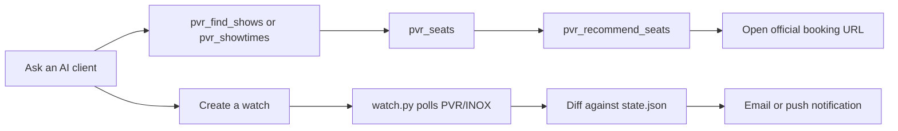
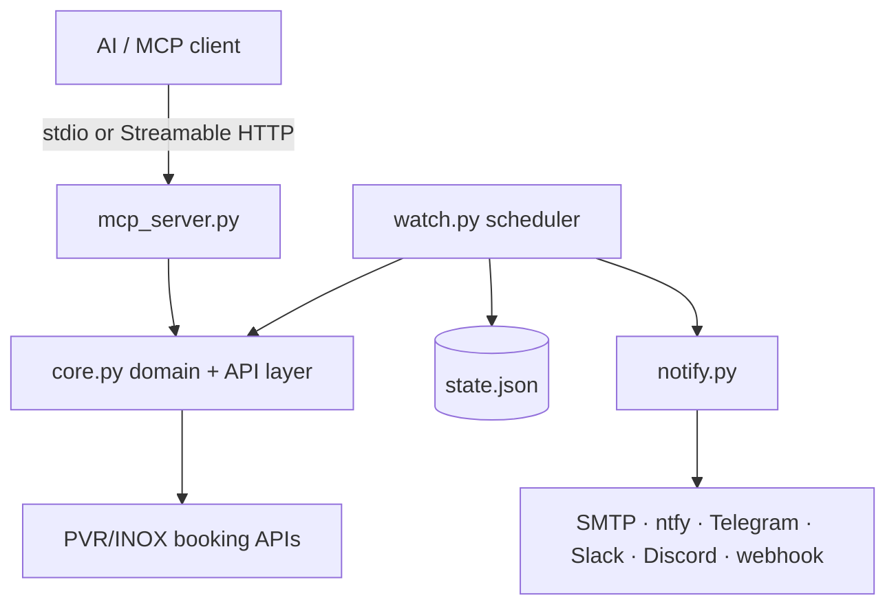

# SeatSignal

### MCP-powered cinema availability and seat intelligence

SeatSignal turns PVR/INOX's live booking data into an AI-callable cinema
assistant and a stateful seat-availability watcher. Instead of trusting a
showtime label such as `Available`, it checks the actual auditorium layout,
finds aisle-safe adjacent groups, ranks exact seat labels, and alerts you when
the seats you care about become available.

It is designed for the frustrating case where a show has hundreds of free
seats, but none in the back-centre block you would actually book.

```text
User request → MCP tools → normalized show data → live seat map
             → exact recommendation → official booking link

Watch config → scheduled polling → state diff → notification
```

SeatSignal is deliberately read-only: it discovers, analyzes, and notifies. It
does not log in, reserve seats, process payment, or complete checkout.

## What the project does

| Capability | What it provides |
|---|---|
| Cinema discovery | Cities, cinema IDs, distances, screen capabilities |
| Showtime intelligence | Normalized film variants, language, format, screen, and booking state |
| Seat intelligence | Free/held/taken counts, aisle-aware runs, preferred viewing zones |
| Exact recommendations | Ranked groups such as `D14-D15` with score breakdowns and reasons |
| Constraint search | Find bookable shows by city, distance, date, language, format, time, and party size |
| Durable monitoring | Detect booking openings, new shows, restocks, releases, and seats-freed events |
| Notifications | Email, ntfy, Telegram, Slack, Discord, Pushover, webhooks, or GitHub Issues |
| MCP integration | Ask an AI client for showtimes, live seats, recommendations, and booking links |

## Why it is technically interesting

The project combines several real engineering problems in one small system:

- undocumented upstream API integration with defensive normalization;
- multilingual and multi-format show identity resolution;
- auditorium geometry and aisle-aware seat adjacency;
- deterministic, explainable ranking instead of a black-box recommendation;
- separation of `not on sale`, `sold out`, `closed`, `completed`, and `unknown`;
- stateful event detection across unreliable polling cycles;
- withheld-seat history, quiet hours, notification deduplication, and failure escalation;
- shared-egress rate limiting, proxy isolation, and bounded concurrency;
- MCP tool design with a read-only remote surface and local file/Git controls;
- GitHub Actions deployment with durable JSON state.

## User flow



## Architecture at a glance



The code is split by responsibility:

- **`core.py`** — upstream requests, normalization, rate limits, status
  classification, seat geometry, exact recommendations, and screen learning.
- **`mcp_server.py`** — exposes `core.py` as MCP tools for an AI client. Local
  stdio mode also exposes watch-management tools; remote mode is read-only.
- **`watch.py`** — polls configured watches, compares snapshots, manages
  cadence, and decides when an event is meaningful.
- **`notify.py`** — sends one logical alert to every configured channel.
- **`watches.json`** — the desired monitoring rules.
- **`state.json`** — generated history used for diffs, restock detection,
  withheld-seat release detection, deduplication, and failure escalation.

For the complete architecture, data-flow, state model, seat-scoring method,
deployment model, failure handling, and operational guide, see
[PROJECT_GUIDE.md](PROJECT_GUIDE.md).

**Coverage:** PVR/INOX cinemas across approximately 116 Indian cities.
Independent cinemas, other chains, and BookMyShow are outside this project's
scope.

## Quick start

Clone the repository and run a safe discovery pass:

```bash
git clone https://github.com/koushik-ch/seatsignal.git
cd seatsignal

# The watcher itself uses only the Python standard library.
python3 watch.py --dry-run --show-all
```

To run the MCP server for an AI client:

```bash
python3 -m venv .venv
source .venv/bin/activate
pip install -r requirements.txt
python3 mcp_server.py
```

To run the durable watcher locally:

```bash
python3 watch.py
```

The watcher reads `watches.json`, polls matching dates and shows, compares the
result with `state.json`, and sends alerts through whichever notification
environment variables are configured. For GitHub Actions deployment, see
[Deploy](#deploy). For the full setup and operational model, see
[PROJECT_GUIDE.md](PROJECT_GUIDE.md).

## What SeatSignal is not

SeatSignal is not a ticket-purchase bot. It does not log in to a personal
account, solve CAPTCHAs, lock seats, submit payment, or bypass BookMyShow. It
ends at an evidence-backed availability result and the official PVR/INOX
booking link.

## Why I built this

The Odyssey had been out for weeks and I still had not seen it. Not for lack of
tickets, there were always tickets. The seats I wanted were gone, week after
week.

I was holding out for IMAX, the way Nolan intended, and for Palazzo
specifically because it has the largest IMAX screen in South India. That is one
auditorium, AUDI 5, and roughly 44 seats in it worth paying for. Those 44 go
first. The listing still reads `Available` long after they are gone, because
400 other seats are still free.

So I stopped reading the listing and defined the seats instead. Rows 60 to 85%
of the way back, centre block between the aisles, which on AUDI 5 comes out as
rows F,E,D,C and seats 11-21. The watcher polls, and it tells me nothing at all
unless a seat inside that block opens.

The second half took longer to work out. PVR does not put a whole auditorium on
sale at once. Rows are held back and released later, sometimes hours later,
with no announcement. The seat map cannot tell you this, because a withheld
seat and a sold seat carry the same code, so there is no flag to read. The only
way to know is history. A seat never once observed free was never on sale, and
when it finally appears that is a release, not a cancellation.

Measured on one Palazzo show: 43 of the 44 zone seats were never free across 14
polls over 16 hours, while 111 to 260 seats sat free elsewhere in the same hall.
That show was not selling out. It had barely been opened.

## What it alerts on

| Event | Meaning |
|---|---|
| `new_date` | A date that answered "closed" now has shows. **The booking window just opened.** |
| `new_show` | An extra session appeared on an already-open date. |
| `back_in_stock` | A session went from Sold Out back to Available - a cancellation or a released block. |
| `seats_freed` | Seats opened up **inside the zone** - the rows and centre block you actually want. The one that matters. |

## How it works

`POST https://api3.pvrcinemas.com/api/v1/booking/content/csessions` with a
cinema id and a date returns that day's sessions. Two findings make this cheap
and reliable:

- **A date not yet open for booking answers `status: 500`.** So "has the window
  opened" is a boolean, not a diff of show lists.
- The endpoint needs an `Authorization: Bearer ` header with an **empty** token.
  Without the header it 403s; with it blank it works. No login, no key.

Every run polls `horizon_days` forward, keeps the shows matching your filters,
and diffs against `state.json` from the previous run.

### Seat-level detail

With `seat_detail: true`, each showtime is followed up with
`POST /api/v1/booking/ticketing/seatlayout` using the `encrypted` token that
`csessions` returns per session. That gives the full seat map:

- `s == 1` is a free seat, `s == 2` is taken (verified against the rendered map)
- entries with no seat name (`sn`) are aisles and gaps - these **break**
  adjacency, since seats either side of an aisle are not "together"

### The zone is the point

A show-level `Available` is close to meaningless: the good seats go first. On
AUDI 5 at Palazzo, shows sitting at 37-114 free seats had **zero** free in the
back-centre block. So `zone_rows` x `zone_seats` defines the seats you'd
actually sit in, and only those trigger `seats_freed`.

AUDI 5 is 15 rows, **O nearest the screen through A at the back**, each split
into three blocks by two aisles - the centre block is seats **11-21**:

```
              SCREEN
 O    1-9      11-21     22-29      front
 N    1-10     11-21     22-31
 ...
 G    1-6      11-21     22-23      (narrow rows)
 D    1-10     11-21     22-31
 A    ----------- 1-34 ----------   back wall
```

A seat outside the zone also **breaks** adjacency, so a run can never straddle
the zone edge and report seats you don't want as part of a block.

#### The zone derives itself

Row letters mean different things in different houses - Palazzo's AUDI 5 runs
O at the front to A at the back over 15 rows; Phoenix's IMAX runs P to A over
16. So hardcoded rows never transfer.

With `zone_rows` / `zone_seats` omitted, the zone is computed from the
auditorium's own geometry:

- **rows** 60-85% of the way back from the screen
- **seats** the aisle-delimited block containing the row's midpoint - the
  actual centre section, not a naive "middle half" that would straddle aisles

That reproduces a hand-picked `F,E,D,C` + `11-21` exactly on Palazzo (44
seats), and independently derives `G,F,E,D,C` (80 seats) on Phoenix. Set the
keys explicitly only to override it.

Alerts then read
`GOOD SEATS: 11 together at D11-D21 (40 free in zone, 15% booked overall)`.

This costs one extra request per showtime, so the calls are issued
concurrently. Already-started ("Lapsed") shows are skipped - they have no seat
map. Sold-out ones are still fetched, since that is where a restock shows up.

Note `bookmyshow.com` is fully Cloudflare-gated - every plain request, including
the mobile-app endpoints with correct headers, returns 403. Going through PVR
direct avoids that entirely.

## Config

`watches.json`:

```json
{
 "watches": [
  {
   "name": "The Odyssey - IMAX - PVR Palazzo",
   "enabled": true,
   "city": "Chennai",
   "cinema_id": "388",
   "cinema_slug": "PVR-Palazzo-The-Nexus-Vijaya-Mall",
   "lat": "13.05053777",
   "lng": "80.2093132",
   "film_contains": "ODYSSEY",
   "experience": "imax",
   "language": "English",
   "horizon_days": 16,
   "weekdays": ["Sat", "Sun"],
   "alert_on_restock": true,
   "seat_detail": true,
   "party_size": 2,
   "min_lead_minutes": 90,
   "zone_rows": ["F", "E", "D", "C"],
   "zone_seats": [11, 21],
   "min_adjacent": 2,
   "priority": 5,
   "quiet_hours": ["23:00", "07:00"],
   "dedup_minutes": 30
  }
 ]
}
```

`weekdays` limits the watch to days you'd actually go (`%a` names - `Mon`,
`Sat`...). Omit it to watch every day. It also cuts the request count sharply,
since every open date costs one seat-map call per showtime - so `horizon_days`
can reach further out for the same work.

`zone_rows` and `zone_seats` (inclusive seat numbers) override the good-seats
zone. Omit both and it derives itself from the auditorium's geometry, which is
usually what you want - see above.

`min_lead_minutes` suppresses alerts for shows starting sooner than that - an
alert for a show beginning in 11 minutes at a cinema 25 km away is accurate and
useless. Those shows are still tracked in state, just not alerted on. Omit it
to alert regardless.

`min_adjacent` is how many seats side by side you need; `seats_freed` fires only
when a show crosses that threshold from below, so a show already above it does
not re-fire every run. Set it to `0` to switch that off.

The watcher monitors zones and adjacent-group thresholds. `pvr_recommend_seats`
can return exact labels such as `D14-D15`, but a durable watch does not yet
accept a strict list of named target seats; that is a natural next extension.

Notification controls are per watch. `priority` is clamped to 1-5 and caps the
urgency sent to channels. `quiet_hours` defers ordinary events until the
window ends. `dedup_minutes` suppresses repeated logical events, but only after
at least one configured channel accepts the original message.

`film_contains` is a case-insensitive substring of the film name.
`experience` matches PVR's key (`imax`, `pxl`, `bigpix`, `4dx`, ...); leave it
empty for any format. `lat`/`lng` should be the cinema's own coordinates - the
API applies a distance filter and will drop the cinema if you are too far.

### Finding a cinema id

```bash
curl -s -X POST https://api3.pvrcinemas.com/api/v1/booking/content/cinemas \
  -H 'Content-Type: application/json' -H 'Authorization: Bearer ' \
  -H 'chain: PVR' -H 'city: Chennai' -H 'country: INDIA' \
  -H 'appVersion: 1.0' -H 'platform: WEBSITE' -H 'flow: PVRINOX' \
  -d '{"city":"Chennai","lat":"13.08","lng":"80.27","text":""}' \
  | python3 -c 'import json,sys;[print(c["theatreId"],c["name"]) for c in json.load(sys.stdin)["output"]["cinemas"]]'
```

## Running

```bash
python watch.py --dry-run --show-all   # poll and print, touches nothing
python watch.py                        # poll, diff, alert, save state
python watch.py --watch "<name>"       # just one watch
python watch.py --test-notification    # verify channels without polling PVR
```

The first run records a baseline silently - otherwise every currently-open date
would fire as a discovery.

## Installing as an Agent Plugin

The repo is a conformant [Agent Plugins](https://agent-plugins.org) v1.0.0
package - `plugin.json` plus `mcp.json` at the root - so a conforming client
can install it from the directory rather than being wired up by hand. Both
manifests validate against the published schemas.

`mcp.json` points at the hosted `streamable-http` endpoint deliberately: that
needs no Python, no `pip install` and no local process, so the plugin works the
moment it is added. Use the stdio setup below if you want the watch-management
tools, which the remote endpoint does not expose.

Note the spec is a **Working Draft**, and these two files are additive - they
change nothing about how the server runs.

## MCP server

Exposes the same core as tools, so any MCP client can ask instead of you
writing throwaway scripts.

```bash
pip install -r requirements.txt
claude mcp add seatsignal -- python3 /path/to/seatsignal/mcp_server.py
```

### Remote endpoint

Deploy your own Cloud Run service and add its `/mcp` URL to your AI client as a
custom remote MCP connector. The repository's `mcp.json` contains a placeholder
that must be replaced with your deployed hostname. The remote surface is
read-only; put authentication in front of it before serving multiple users.

Deployed to Cloud Run (`asia-south1`, close to the origin), scale-to-zero:

```bash
gcloud run deploy seatsignal-mcp --source . --region=asia-south1 \
  --allow-unauthenticated \
  --set-env-vars="PVR_MCP_TRANSPORT=streamable-http,PVR_MCP_HOST=0.0.0.0,\
PVR_MCP_PATH=/mcp,PVR_MCP_ALLOWED_HOSTS=<your-run-hostname>,\
PVR_MAX_CALLS_PER_MIN=60,PVR_BURST=20"
```

#### Run TWO services, not one

The watcher cannot call the chain from a GitHub runner - its IP is refused -
so it borrows this service's IP through the token-gated `/proxy` route. Put
that on the SAME service you hand out to strangers and the two share an egress
IP, which means they share a blast radius: a stranger tripping the chain's
15-minute block takes your 05:26 booking-window watch down with it. The
`priority` flag exempts the proxy from OUR ceiling, but nothing exempts it from
an upstream block once the IP is flagged.

So deploy the image twice:

| Service | `PVR_PROXY_TOKEN` | Ceiling | Who uses it |
|---|---|---|---|
| `seatsignal-mcp` | **unset** | on | anyone with the URL |
| `seatsignal-proxy` | set | on | the watcher only, unadvertised |

With the token unset, the `/proxy` route answers 404 - the handler disables
itself, so the public service has no path to lend its IP at all. Point the
repo's `PVR_PROXY_BASE` secret at the proxy service, and deploy the public one
without the token:

```bash
gcloud run deploy seatsignal-proxy --source . --region=asia-south1 \
  --allow-unauthenticated \
  --set-env-vars="PVR_MCP_TRANSPORT=streamable-http,PVR_MCP_HOST=0.0.0.0,\
PVR_MCP_PATH=/mcp,PVR_MCP_ALLOWED_HOSTS=*,PVR_MAX_CALLS_PER_MIN=30,\
PVR_BURST=20,PVR_PROXY_TOKEN=<the same token the watcher holds>"

gh secret set PVR_PROXY_BASE --body "https://<proxy-service-url>"
```

The proxy service still serves `/mcp`, since there is no flag to turn the tools
off. That is harmless as long as the URL is not advertised, and its ceiling
covers any stray caller who finds it - the watcher's own traffic is exempt.

#### The ceiling is not optional on a public deployment

`PVR_MIN_INTERVAL` paces upstream calls but never refuses one, so a burst of
callers queues and the whole queue still arrives - and the chain answers that
by blocking the IP for 15 minutes. Every user of a hosted instance shares ONE
egress IP, so popularity and an outage are the same event without a ceiling.

`PVR_MAX_CALLS_PER_MIN` (0 = off, the default) caps upstream calls per process
and sheds the excess as `ERROR RATE_LIMITED`, which is cheap to retry.
`PVR_BURST` is how much slack it allows first. The token-gated `/proxy` path is
exempt: that is the operator's own watcher, and starving it is the exact
failure the ceiling exists to prevent.

Leave it off for local stdio use and for the cron watcher - both are a single
known caller.

`PVR_MCP_ALLOWED_HOSTS` is required, and for a public connector it should be
`*`. MCP enables DNS-rebinding protection by default, which checks **two**
headers:

- **`Host`** - validated against localhost only, so a hosted deployment answers
  **HTTP 421** until its own hostname is listed.
- **`Origin`** - a browser-based client such as Claude's connector sends
  `Origin: https://claude.ai`, which is rejected with **HTTP 403 "Invalid
  Origin header"** unless that origin is allowed. The connector just spins.

A client called with no `Origin` header at all passes both checks, so testing
with curl or a Python client will not reveal the second problem. `*` turns the
protection off, which is the right setting for an intentionally public,
read-only endpoint.

### Serving it remotely

```bash
PVR_MCP_TRANSPORT=streamable-http PVR_MCP_PORT=8760 python3 mcp_server.py
```

Put TLS in front of it and the URL works as a custom connector.

**The four watch-management tools are not registered in remote mode.** A
remote URL is reachable by anyone holding it, and `pvr_publish_watches` runs
`git push`. Rather than guard them, remote mode simply never registers them -
absent beats guarded, since there is no handler to reach. Remote exposes only
the read-only lookup tools.

| Remote lookup tool | Answers |
|---|---|
| `pvr_cities` | Which cities the chain covers |
| `pvr_cinemas` | Cinemas in a city + the `cinema_id` everything else needs |
| `pvr_now_showing` | What's playing, with certificate, length, formats |
| `pvr_showtimes` | Showtimes at a cinema on a date |
| `pvr_seats` | **Live seat availability, zone counted separately** - the one that matters |
| `pvr_recommend_seats` | Exact party-sized seat groups ranked by centre, depth, edge clearance and zone |
| `pvr_find_shows` | Constrained multi-cinema search with optional seat verification |
| `pvr_screens` | Learned auditorium size and screen geometry |
| `pvr_is_open` | Is that date on sale yet |

Local stdio mode additionally exposes the watch-management tools:

| Local tool | Purpose |
|---|---|
| `pvr_list_watches` | Show configured watches and whether they are published |
| `pvr_add_watch` | Create a watch conversationally |
| `pvr_remove_watch` | Delete a watch |
| `pvr_publish_watches` | Commit and push the watch configuration |

`pvr_seats` takes `seat_map=true` for an ASCII auditorium, which makes
the problem obvious at a glance (`O` free in zone, `x` taken in zone, `o` free
outside it, `.` taken outside it):

```
                    SCREEN
 P        oo  ooooooooooooooo   oooo         front: wide open
 ...
 G    ......  xxxxxxxxxxxxxxxx  .......o     zone: solid
 F    ......  xxxxxxxxxxxxxxxx  ........
 E    ......  xxxxxxxxxxxxxxxx  ........
```

That show reads "Filling Up Fast" with 75% booked - and not one free seat
worth having. The server's instructions tell the client to never call a show
bookable on show-level status alone.

`pvr_recommend_seats` is the actionable companion to `pvr_seats`. It enumerates
exact party-sized windows inside free runs, never crosses an aisle, and returns
the top pick, alternatives, score breakdowns and reasons. The score is a
recommendation, not a reservation; seats can change before the official booking
flow completes.

### Setting up a watch by asking

`pvr_add_watch` resolves a cinema name fragment to its id and
coordinates, then sanity-checks the film against what that cinema is listing
today - so a typo surfaces immediately rather than as months of silence:

```
WARNING: nothing matches 'ODDYSSEY' in imax at this cinema today.
```

An ambiguous cinema is refused rather than guessed:

```
'PVR' matches 12 cinemas in Chennai - be more specific:
  388  PVR Palazzo-The Nexus Vijaya Mall
  331  PVR Sathyam Royapettah Chennai
  ...
```

**A new watch is not live when it is added.** The cron runs the *committed*
config, so adding one only edits the local file; `pvr_publish_watches`
commits and pushes it. That split is deliberate - publishing pushes to a
public repository, which should be a decision rather than a side effect.
`pvr_list_watches` flags the gap whenever the file is dirty.

## Deploy

Runs on GitHub Actions cron (`.github/workflows/watch.yml`), every 5 minutes,
committing `state.json` back to the repo so the diff survives between runs.

1. Push this to its **own repo**. Keep it public - 5-minute cron on a private
   repo burns ~8,600 Actions minutes a month against a 2,000 free allowance.
   Nothing sensitive is in the code.
2. Pick a notification channel below and add its secrets to the repo.
3. Actions tab -> "SeatSignal watch" -> Run workflow, to record the baseline.

## Two ways to be told

If you already have an MCP client, you may not need a notification service at
all - but the two modes are not interchangeable, and the difference is what
happens when you close your laptop.

| | Durable watch | In-session watch |
|---|---|---|
| Runs on | GitHub Actions cron | Your machine, inside an agent session |
| Setup | Repo + one secret | **None** - the MCP is already there |
| Survives closing the laptop | **Yes** | No |
| Survives closing the agent | **Yes** | No |
| Good for | Days of waiting for an unknown moment | An afternoon of watching for a restock |

**In-session** is `watch.py --stream`, which polls forever and prints one line
per event on stdout - the shape an agent watch tool wants:

```bash
python watch.py --stream --interval 60
```
```
🚨 Booking just opened | The Odyssey IMAX | Sat 15 Aug 09:00 AM | 11 together - D11-D21
🪑 Good seats opened up | The Odyssey IMAX | Sat 8 Aug 04:05 PM | 4 together - C16-C19
```

Point an agent's monitor at that and each line becomes a notification. Note
what it does *not* do: wake a model every minute to poll an API. The polling
stays in Python, where it is free, and only real events reach the model.

**The catch, and it decides the choice:** agent-side schedulers are tied to the
session. Claude Code's cron jobs live only in the current session, fire only
while it is idle, and expire after 7 days; monitors end when the session ends.
A booking window opening on a Monday morning while your laptop is shut is
exactly the case that needs the durable path.

Use in-session for a watch measured in hours. Use the cron for anything longer.

## Notification channels

Set the environment variables for the channel you want and it switches itself
on. Configure several and all of them get the alert. Nothing to edit in code.

| Channel | Variables | Cost / friction |
|---|---|---|
| **ntfy** | `NTFY_TOPIC` (opt. `NTFY_SERVER`) | **No account at all.** Install the app, pick a topic name. Sent at priority 5 so it breaks through a silenced phone. |
| **Telegram** | `TELEGRAM_BOT_TOKEN`, `TELEGRAM_CHAT_ID` | Free. ~5 min with @BotFather. Reliable lock-screen push. |
| **Pushover** | `PUSHOVER_USER_KEY`, `PUSHOVER_APP_TOKEN` | $5 one-off. The best custom alert sounds. |
| **Slack** | `SLACK_WEBHOOK_URL` | Free. Only useful if you live in Slack. |
| **Discord** | `DISCORD_WEBHOOK_URL` | Free, same shape as Slack. |
| **Email** | `SMTP_HOST`, `SMTP_USER`, `SMTP_PASS`, `EMAIL_TO` (opt. `SMTP_PORT`) | Universal, but does not reliably wake you. |
| **Generic webhook** | `GENERIC_WEBHOOK_URL` | POSTs `{title, text, url}`. Bridge to anything else. |
| **GitHub issue** | `GITHUB_TOKEN`, `GITHUB_REPOSITORY` | Zero extra accounts - the Actions run already has both. Relies on GitHub app notifications. |

**If you want to be woken up, use ntfy, Telegram or Pushover.** Email and
GitHub issues are for a record, not an interrupt - and an alert you don't see
is not an alert.

Two that are deliberately absent, both because of Indian regulatory friction
rather than technical difficulty: **WhatsApp** needs a Meta Business account
and template pre-approval, and **SMS/voice** to Indian numbers needs DLT
registration. Use the generic webhook to bridge to either if you have that set
up already.

Messages are plain text with real emoji, so they render the same everywhere -
no Slack `:codes:` leaking into a Telegram message.

### Timing caveat

GitHub's cron floor is 5 minutes and scheduled runs are routinely delayed 5-15
minutes under load, occasionally skipped. That is fine for catching a booking
window opening - the listing goes up in a batch and stays up. It will not win a
seat race measured in seconds. If that matters, move the same script to an
always-on box on a 30-second loop; nothing in it is Actions-specific.

This repository does not include a hosted service. Deploy your own copy for
personal evaluation. No open-source license is currently declared; obtain
permission before redistributing or using the project commercially.
