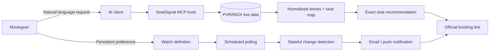
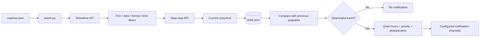
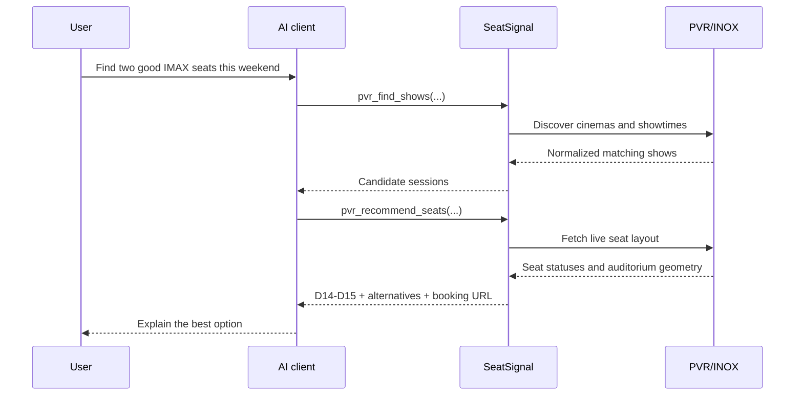
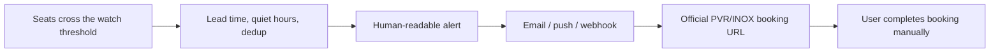
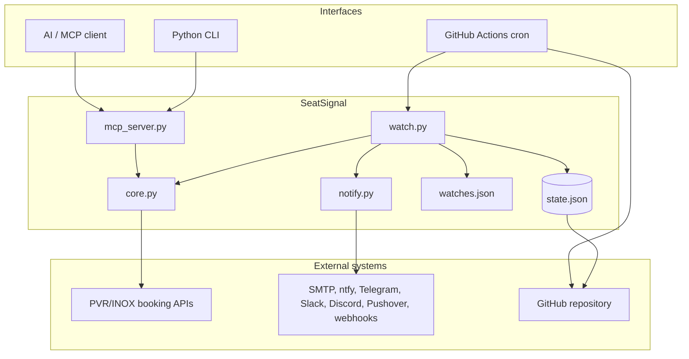
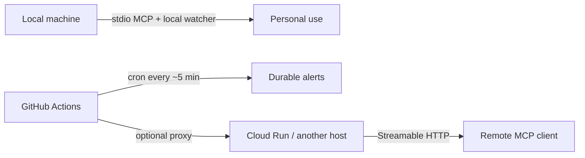

# SeatSignal

### Cinema availability intelligence for the seats you would actually book

SeatSignal is a read-only cinema assistant and autonomous availability watcher
for PVR/INOX cinemas in India. It turns live showtime and seat-map data into
one useful answer:

> “Tell me when two adjacent seats in my preferred part of the auditorium are
> available—and send me the official booking link.”

It can answer questions through an AI client using the Model Context Protocol
(MCP), or keep watching in the background and notify you when something worth
booking changes.

SeatSignal does **not** log in, reserve seats, bypass CAPTCHAs, process payment,
or complete checkout. It stops at an evidence-backed recommendation and the
official PVR/INOX booking URL.

## Product pitch

Most cinema sites expose a show-level label such as `Available`. That label is
not enough: a show can have hundreds of free seats while every seat in the
back-centre block is gone.

SeatSignal lets a person express the decision they actually care about:

- a film, city, cinema, language, and format;
- a date range and time window;
- a party size and minimum adjacent seats;
- a preferred viewing zone, or an automatically derived centre zone;
- the notification channels that should wake them up.

The product then discovers shows, reads the live auditorium layout, respects
aisles, ranks exact seat labels, remembers what it saw previously, and alerts
only when a meaningful event occurs.

## The product in one glance



There are two complementary product surfaces:

| Surface | Best for | What happens |
|---|---|---|
| **AI assistant** | Finding and evaluating a show now | Ask for cinemas, showtimes, live seats, or ranked recommendations. |
| **Durable watcher** | Waiting hours or days for a change | A scheduled job polls in the background and alerts only on relevant events. |

## What users can do

| Use case | Example request or outcome |
|---|---|
| Find a cinema | “Which PVR cinemas in Chennai are near me?” |
| Discover movies | “What English films are showing in Chennai?” |
| Find a constrained show | “Find an IMAX show this weekend after 11 AM.” |
| Inspect live availability | “How many seats are free for this show?” |
| Choose seats intelligently | “Find two adjacent seats in the centre, 60–85% back.” |
| Watch a booking window | Notify me when next Saturday’s shows go on sale. |
| Watch a restock | Notify me when a sold-out show becomes available again. |
| Watch a specific zone | Notify me when two seats open in rows F–C, seats 11–21. |
| Detect released blocks | Identify seats that were never previously visible as free. |
| Receive alerts anywhere | Email, ntfy, Telegram, Slack, Discord, Pushover, webhook, or GitHub Issue. |

## Why seat-level intelligence matters

The important question is not “does this show say available?” It is “can my
party sit together in a good part of the auditorium?”

SeatSignal treats an auditorium as geometry rather than a flat list:

```text
                         SCREEN

             left block     centre block      right block
front     O  O  O  O  O   O  O  O  O  O  O   O  O  O  O
          .  .  .  .  .   O  O  x  x  O  O   .  .  .  .
preferred .  .  .  .  .   O  O  O  O  O  O   .  .  .  .
zone      .  .  .  .  .   x  x  O  O  O  O   .  .  .  .
back      O  O  O  O  O   O  O  O  O  O  O   O  O  O  O

O = free       x = taken       . = unavailable
```

The recommendation engine:

1. groups seats by row;
2. breaks a run at aisles and gaps;
3. searches for a contiguous window large enough for the party;
4. scores each window by centre position, depth, zone preference, and edge
   clearance;
5. returns exact labels such as `D14-D15`, alternatives, and reasons.

It never claims that seats are reserved. Availability can change before the
user completes the official booking flow.

## Persistent watching

A watch is a product rule, not a one-off query. The watcher stores the previous
observations in `state.json`, so it can tell the difference between a first
baseline and a meaningful change.



The watcher can emit these events:

| Event | Product meaning |
|---|---|
| `new_date` | A previously closed date has opened for booking. |
| `new_show` | An additional matching session appeared. |
| `back_in_stock` | A sold-out session is available again. |
| `seats_freed` | The preferred zone crossed the required adjacent-seat threshold. |
| failure escalation | Repeated upstream or network failures made a watch unreliable. |

The first successful run establishes a baseline silently. This prevents a user
from receiving alerts for everything that was already available when the watch
started.

## How a person uses it

### 1. Ask the AI assistant

An MCP-compatible client can call the read-only tools in a deliberate sequence:



Useful tools include:

| Tool | Purpose |
|---|---|
| `pvr_cities` | List supported cities. |
| `pvr_cinemas` | Find cinemas and their IDs. |
| `pvr_now_showing` | Discover films and formats. |
| `pvr_showtimes` | Get sessions for a cinema and date. |
| `pvr_seats` | Inspect live hall and zone availability. |
| `pvr_recommend_seats` | Rank exact party-sized seat groups. |
| `pvr_find_shows` | Search across constraints, optionally verifying seats. |
| `pvr_screens` | View learned auditorium geometry. |
| `pvr_is_open` | Check whether a date has gone on sale. |

Local stdio mode additionally provides watch-management tools:
`pvr_list_watches`, `pvr_add_watch`, `pvr_remove_watch`, and
`pvr_publish_watches`. Remote MCP mode intentionally exposes only read-only
lookup tools; it does not expose a public endpoint that can edit files and push
to Git.

### 2. Create a durable watch

A watch can be written in `watches.json` or created conversationally through
the local MCP tools. A compact example:

```json
{
  "watches": [
    {
      "name": "IMAX weekend seats",
      "enabled": true,
      "city": "Chennai",
      "cinema_id": "388",
      "cinema_slug": "PVR-Palazzo-The-Nexus-Vijaya-Mall",
      "film_contains": "ODYSSEY",
      "language": "English",
      "experience": "imax",
      "horizon_days": 14,
      "weekdays": ["Sat", "Sun"],
      "time_between": ["11:00", "15:00"],
      "party_size": 2,
      "min_adjacent": 2,
      "seat_detail": true,
      "zone_rows": ["F", "E", "D", "C"],
      "zone_seats": [11, 21],
      "min_lead_minutes": 90,
      "priority": 5,
      "quiet_hours": ["23:00", "07:00"],
      "dedup_minutes": 30
    }
  ]
}
```

`zone_rows` and `zone_seats` are optional. If omitted, SeatSignal derives a
preferred zone from the auditorium’s own row and aisle geometry: approximately
60–85% of the way back, in the aisle-delimited centre block. Explicit values
are useful when a user has a very specific preference.

### 3. Receive the alert and book officially



The notification contains the film, cinema, showtime, event, exact seat run
when available, and a booking link. It is an alerting product, not an
auto-purchase bot.

## Architecture



### Component responsibilities

| Component | Responsibility |
|---|---|
| `core.py` | Upstream requests, defensive normalization, rate limiting, show status, seat geometry, recommendations, and screen learning. |
| `mcp_server.py` | Exposes the domain capabilities as MCP tools over local stdio or Streamable HTTP. |
| `watch.py` | Polls configured watches, applies filters, diffs snapshots, manages cadence, and decides when an event matters. |
| `notify.py` | Delivers one logical alert to every configured channel and reports partial delivery failures. |
| `watches.json` | User-owned desired monitoring rules. |
| `state.json` | Generated history for change detection, restocks, released seats, deduplication, and failure escalation. |
| `.github/workflows/watch.yml` | Five-minute durable scheduler that runs the watcher and persists state. |

## Deployment choices



### Local development

```bash
git clone https://github.com/koushik-ch/seat-signal.git
cd seat-signal

python3 -m venv .venv
source .venv/bin/activate
pip install -r requirements.txt

# Safe discovery: prints results, sends nothing, writes no state.
python3 watch.py --dry-run --show-all

# One normal poll: compares state and sends configured notifications.
python3 watch.py

# Run only one configured watch.
python3 watch.py --watch "IMAX weekend seats"

# Validate notification credentials without polling cinema data.
python3 watch.py --test-notification
```

The watcher itself uses the Python standard library. `requirements.txt` is for
the MCP server and its transport dependencies.

### Local MCP server

```bash
python3 mcp_server.py
```

For a client that supports command-based MCP configuration:

```bash
claude mcp add seatsignal -- python3 /absolute/path/to/seat-signal/mcp_server.py
```

### Durable GitHub Actions watcher

The included workflow runs approximately every five minutes, commits the
generated state back to the repository, and keeps monitoring alive after the
laptop is closed. GitHub schedule timing can drift under load, so it is suited
to booking-window openings and restocks—not second-by-second seat races.

Add repository secrets under **Settings → Secrets and variables → Actions**:

| Purpose | Secrets |
|---|---|
| PVR access through a deployed proxy | `PVR_PROXY_BASE`, `PVR_PROXY_TOKEN` |
| Email | `SMTP_HOST`, `SMTP_PORT` (optional), `SMTP_USER`, `SMTP_PASS`, `EMAIL_TO` |
| ntfy | `NTFY_TOPIC`, optional `NTFY_SERVER` |
| Telegram | `TELEGRAM_BOT_TOKEN`, `TELEGRAM_CHAT_ID` |
| Slack / Discord | `SLACK_WEBHOOK_URL` / `DISCORD_WEBHOOK_URL` |
| Pushover | `PUSHOVER_USER_KEY`, `PUSHOVER_APP_TOKEN` |
| Generic integration | `GENERIC_WEBHOOK_URL` |

Run **SeatSignal watch** manually once after configuring secrets. The first
run creates the baseline; later runs can emit changes.

### Remote MCP

Set `PVR_MCP_TRANSPORT=streamable-http` and deploy `mcp_server.py` behind TLS,
for example on Cloud Run. Replace the placeholder URL in `mcp.json` with your
service’s `/mcp` endpoint.

For a durable watcher using GitHub-hosted runners, the repository also supports
a token-gated proxy deployment. Keep the public MCP service and the private
watcher proxy as separate services so public traffic cannot consume the same
upstream rate-limit budget. The complete deployment topology and security
configuration are documented in [PROJECT_GUIDE.md](PROJECT_GUIDE.md).

## Notifications

Configure one or more channels through environment variables. SeatSignal sends
the same logical alert to every enabled channel.

| Channel | Cost / behavior |
|---|---|
| ntfy | No account required; excellent phone push notifications. |
| Telegram | Free bot-based push notifications. |
| Pushover | One-time paid app; strong custom alert sounds. |
| Slack / Discord | Free webhook-based delivery. |
| Email | Universal record, but less reliable as an urgent interrupt. |
| Generic webhook | Integrate with any service that accepts JSON. |
| GitHub Issue | Uses the Actions token and GitHub notifications. |

If no channel variables are present, the watcher can still poll and print
diagnostics, but it cannot deliver an alert.

## Reliability and safety model

- **Read-only upstream behavior:** the project discovers and analyzes data only.
- **Explicit availability states:** `closed`, `not on sale`, `sold out`,
  `available`, `lapsed`, and `unknown` are not treated as interchangeable.
- **Aisle-safe recommendations:** a group never crosses an aisle or unavailable
  gap.
- **Stateful diffs:** transient network failures do not masquerade as a booking
  window opening.
- **Quiet hours and deduplication:** repeated observations do not spam users.
- **Failure escalation:** repeated failures can generate an operational alert.
- **Rate limiting and bounded concurrency:** requests are paced to reduce the
  chance of upstream blocking.
- **Separated configuration and state:** `watches.json` is user configuration;
  `state.json` is generated history persisted by the watcher so scheduled runs
  can compare observations. Secrets belong in the deployment environment.

## Current boundaries

- Coverage is focused on PVR/INOX cinemas across approximately 116 Indian
  cities; independent cinemas and other chains are outside the current scope.
- The upstream booking endpoints are undocumented and may change.
- The five-minute GitHub Actions schedule is not real-time.
- A durable watch currently expresses a preferred zone and adjacency threshold;
  strict named-seat lists are a natural extension.
- A recommendation is a point-in-time observation, not a reservation guarantee.
- This repository currently declares no open-source license. Obtain permission
  before redistributing or using it commercially.

## Repository map

```text
seat-signal/
├── core.py                       # API integration and seat intelligence
├── mcp_server.py                 # MCP tools and transports
├── watch.py                      # Stateful polling and event detection
├── notify.py                     # Notification adapters
├── watches.json                  # User watch definitions
├── .github/workflows/watch.yml   # Durable five-minute scheduler
├── Dockerfile                    # Container deployment
├── mcp.json                      # Remote MCP plugin configuration
├── plugin.json                   # Agent plugin metadata
├── tests/                        # Core, watcher, and MCP contract tests
├── PROJECT_GUIDE.md              # Deep technical and operational guide
└── README.md                     # Product overview and quick start
```

## Why this is a meaningful engineering project

SeatSignal is more than an API wrapper. It combines:

- product-level constraint modeling for a real user decision;
- defensive integration with undocumented, changing upstream APIs;
- geometry-aware search and explainable ranking;
- state machines for booking windows, restocks, and released inventory;
- durable scheduling and idempotent notifications;
- MCP interface design for AI-driven workflows;
- deployment, rate-limit isolation, secrets handling, and operational failure
  semantics.

For implementation details, data contracts, invariants, deployment runbooks,
and extension points, read the [complete project guide](PROJECT_GUIDE.md).
